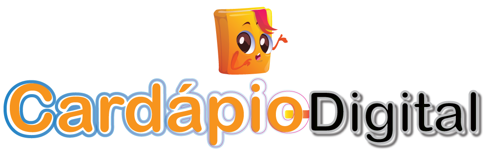

### Projeto PHP puro com proposito a criação de um menu digital informativo sobre os produtos criados pela confeitaria, demonstrando imagens de cada produto, descrição de ingredientes, dicas de quantidade por pessoa para o evento e valores. 
#### O sistema não terá compras online ou um sistema de pagamento neste primeiro momento, pois a idéia é seguir um formato de venda e confirmação de pedido para o cliente via WhatsApp.
#### Outra atividade que terá é um blog para criação de dicas e informativos para os clientes.

 #### **Requisitos Funcionais (RF)**
 ##### Os requisitos funcionais referem-se sobre o que o sistema deve fazer, ou seja, suas funções e informações.
- [RF001] O Sistema deve autenticar o usuário administrador.
- [RF002] O Sistema deve ter uma dashboard administrativa.
- [RF003] O Sistema deve ter estatiscas de navegação.
- [RF004] O Sistema deve ter administração de perguntas frequentes.
- [RF005] O Sistema deve ter administração de produtos CRUD.
- [RF006] O Sistema deve ter administração de categorias CRUD.
- [RF007] O Sistema deve ter administração do blog CRUD.
- [RF008] O Sistema deve ter administração do perfil das paginas.
- [RF009] O Sistema deve gerar relatórios PDF.

 #### **Requisitos Não-Funcionais (RNF)**
###### requisitos não funcionais definem propriedades e restrições do sistema como tempo, espaço, linguagens de programação, versões do compilador, SGBD, Sistema Operacional, método de desenvolvimento, etc.
- [RNF001] O sistema deve imprimir o relatório em até 5 segundos.
- [RNF002] O sistema deve ser implementado em Php.
- [RNF003] O sistema deve ser implementado em Php.
- [RNF004] O sistema deve ser implementado utilizando dependências para melhor agilidade de desenvolvimento.

 #### **Diagrama de classes**
##### O diagramas de arquitetura de software oferecem a toda a equipe de desenvolvimento um panorama visual, facilitando a comunicação de ideias e conceitos-chave em termos que todos entendem.
